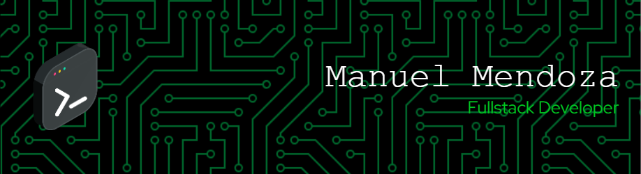

#  Welcome to My GitHub

<!-- Descripcion -->

## Skills

#### 🕓 Version Control

#### 📋 Languages

#### 📚 Frameworks, Platforms and Libraries

#### 💾 Databases

#### 🥅 Other

#### 💻 IDEs/Editors

### Repository statistics
<!--  -->

<!--
**AlexMdz5620/AlexMdz5620** is a ✨ _special_ ✨ repository because its `README.md` (this file) appears on your GitHub profile.

Here are some ideas to get you started:

- 🔭 I’m currently working on ...
- 🌱 I’m currently learning ...
- 👯 I’m looking to collaborate on ...
- 🤔 I’m looking for help with ...
- 💬 Ask me about ...
- 📫 How to reach me: ...
- 😄 Pronouns: ...
- ⚡ Fun fact: ...
-->
